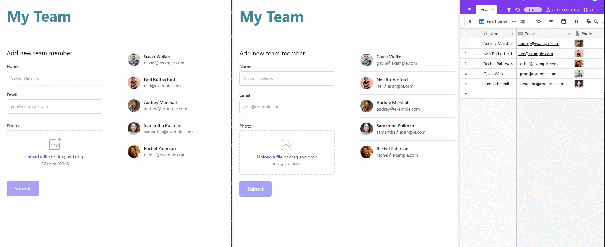

# Ycode Test

### Requirements: 

* To create a page which connects to Airtable and renders its data in a table format. 
* It should also include a form which on submission, data will be posted back to Airtable and appear in your table.
* The website should be able to withstand thousands of visitors at one time.

### Limitation:
* Airtable limits API access by 5 requests per second

### Solutions:
* Use Redis to serve a cached version of Airtable data by implementing `expire-on-write`
* Use Queue to handle Airtable data creation
* Use WebSocket to broadcast submitted data to every user so that they get the effect of real-time updates

### Installation:

This application can be run by using `docker-compose`

Configure environment variable in the `docker-compose.yml` file

```bash
AIRTABLE_KEY:
AIRTABLE_BASE:
AIRTABLE_TABLE:
AWS_DEFAULT_REGION: 
AWS_BUCKET:
AWS_ACCESS_KEY_ID:
AWS_SECRET_ACCESS_KEY:
AWS_BUCKET_URL:
WEBSOCKET_URL: "http://xxx:8889" // Configure the host

```

Then run

```bash
docker-compose build

docker-compose up -d
```

Then go to `your-host`:8888

## Proof

